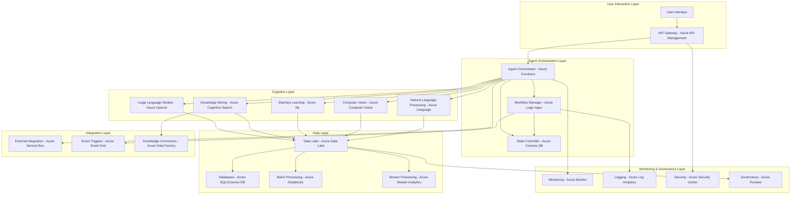

# AgenticAI
AgenticAI

# Agentic AI: Azure Implementation for Technical Audiences

## Introduction to Agentic AI

- **Definition**: Agentic AI refers to AI systems that can independently take actions to achieve specific goals
- **Key characteristics**:
  - **Autonomy**: Ability to operate with minimal human supervision
  - **Goal-orientation**: Designed to accomplish specific objectives
  - **Environmental awareness**: Perceives and interprets surroundings
  - **Adaptability**: Adjusts strategies based on feedback and outcomes
  - **Decision-making**: Evaluates options and selects optimal actions
  
- **Evolution from traditional AI systems**:
  - Early AI: Rule-based systems with predefined responses
  - Machine Learning: Pattern recognition and prediction
  - LLMs: Advanced understanding and generation capabilities
  - Agentic AI: Proactive decision-making and action-taking

- **Azure's role in Agentic AI**:
  - Provides scalable infrastructure
  - Offers pre-built AI services
  - Enables seamless integration with existing systems
  - Supplies development tools for custom agent creation

---

## Difference Between AI Agents and Agentic AI

### AI Agents
- **Narrowly scoped**: Designed for specific tasks and domains
- **Typically reactive**: Respond to explicit prompts or events
- **Limited context awareness**: Function within defined parameters
- **Examples**: Chatbots, virtual assistants, recommendation engines

### Agentic AI
- **Broader capability**: Can handle complex, multi-step tasks
- **Proactive behavior**: Initiates actions based on goals without explicit instructions
- **Extended context understanding**: Maintains awareness across interactions
- **Planning abilities**: Formulates strategies to achieve objectives
- **Reasoning**: Evaluates multiple paths and selects optimal approaches
- **Self-improvement**: Learns from experiences to enhance performance

### Azure Implementation Differences
- **AI Agents in Azure**:
  - Bot Framework
  - Language Understanding (LUIS)
  - QnA Maker
  
- **Agentic AI in Azure**:
  - Azure OpenAI Service
  - Azure Cognitive Services
  - Azure Machine Learning
  - Azure Functions for orchestration
  - Azure Knowledge Mining

---

## Use Cases for Agentic AI

### Retail and Consumer Goods

1. **Intelligent Inventory Management**
   - Autonomous monitoring of stock levels
   - Dynamic reordering based on predictive analytics
   - Supply chain optimization through multi-factor analysis
   - Implementation using Azure IoT Hub, Azure Digital Twins, and Azure OpenAI

2. **Personalized Shopping Experience**
   - Proactive product recommendations based on customer behavior
   - Autonomous virtual shopping assistants
   - Dynamic pricing strategies optimized for individual shoppers
   - Implementation using Azure Personalizer, Azure Cosmos DB, and Azure Functions

3. **Automated Visual Merchandising**
   - Store layout optimization using computer vision
   - Real-time planogram compliance monitoring
   - Customer flow analysis and adjustment
   - Implementation using Azure Computer Vision, Azure Spatial Analysis, and Azure Data Explorer

4. **Predictive Maintenance for Retail Equipment**
   - Autonomous monitoring of refrigeration units, POS systems, etc.
   - Proactive service scheduling before failures occur
   - Resource optimization for maintenance teams
   - Implementation using Azure IoT Edge, Azure Stream Analytics, and Azure Machine Learning

### Healthcare

1. **Clinical Decision Support**
   - Autonomous analysis of patient data
   - Proactive identification of potential health risks
   - Treatment recommendation generation
   - Implementation using Azure Health Data Services, Azure OpenAI, and Azure Health Bot

2. **Patient Journey Optimization**
   - Automated appointment scheduling and rescheduling
   - Personalized care plan generation and adjustment
   - Resource allocation across healthcare facilities
   - Implementation using Azure Logic Apps, Azure Healthcare APIs, and Azure Cognitive Services

3. **Medical Imaging Analysis**
   - Autonomous screening of medical images
   - Anomaly detection and prioritization
   - Workflow optimization for radiologists
   - Implementation using Azure Health Insights, Azure Container Instances, and Azure Machine Learning

4. **Drug Discovery and Development**
   - Autonomous exploration of chemical compounds
   - Clinical trial optimization
   - Research literature analysis and knowledge extraction
   - Implementation using Azure Batch, Azure High-Performance Computing, and Azure OpenAI

---

## Reference Architecture for Agentic AI

### Key Components Explained

1. **User Interaction Layer**
   - Interfaces for human-agent interaction
   - API management for external systems communication

2. **Agent Orchestration Layer**
   - Coordinates agent activities and workflow
   - Maintains state and context across interactions
   - Handles decision logic and action prioritization

3. **Cognitive Layer**
   - Core AI capabilities powering agent intelligence
   - Multiple specialized services working together
   - Azure OpenAI for reasoning and language generation

4. **Data Layer**
   - Storage and processing of structured and unstructured data
   - Scalable analytics capabilities
   - Historical data management for learning

5. **Integration Layer**
   - Connections to external systems and data sources
   - Event-driven architecture for responsiveness
   - Data transformation and normalization

6. **Monitoring & Governance Layer**
   - Performance monitoring and optimization
   - Security and compliance enforcement
   - Auditing and transparency mechanisms

---

## Getting Started with Agentic AI: A Startup Guide

### Step 1: Define Your Agent's Purpose and Scope
- Identify specific business problems to solve
- Determine required capabilities and limitations
- Set clear success metrics and constraints
- Create a prioritized feature roadmap

### Step 2: Build Your Knowledge Foundation
- **Azure Resources to Leverage**:
  - Azure Cognitive Search for knowledge base creation
  - Azure Blob Storage for document storage
  - Azure Form Recognizer for document processing
  - Azure OpenAI for knowledge extraction

- **Implementation Steps**:
  1. Organize domain knowledge in structured formats
  2. Create vector embeddings of knowledge using Azure OpenAI
  3. Set up efficient retrieval mechanisms
  4. Implement continuous knowledge update processes

### Step 3: Develop Core Reasoning Capabilities
- **Azure Resources to Leverage**:
  - Azure OpenAI Service
  - Azure Machine Learning
  - Azure Cognitive Services

- **Implementation Steps**:
  1. Select appropriate foundation models
  2. Fine-tune models for domain-specific tasks
  3. Implement prompt engineering techniques
  4. Create reasoning frameworks using chain-of-thought approaches

### Step 4: Design Action Framework
- **Azure Resources to Leverage**:
  - Azure Functions for discrete actions
  - Azure Logic Apps for workflows
  - Azure API Management for external system integration

- **Implementation Steps**:
  1. Define action library with clear inputs/outputs
  2. Create secure connectors to required systems
  3. Implement validation and safety checks
  4. Design rollback mechanisms for failed actions

### Step 5: Build Orchestration Layer
- **Azure Resources to Leverage**:
  - Azure Functions for orchestration logic
  - Azure Cosmos DB for state management
  - Azure Event Grid for event handling

- **Implementation Steps**:
  1. Implement planning algorithms
  2. Create state management systems
  3. Design feedback loops for learning
  4. Build context maintenance mechanisms

### Step 6: Implement Security and Governance
- **Azure Resources to Leverage**:
  - Azure Key Vault for credential management
  - Azure Security Center for security monitoring
  - Azure Purview for data governance
  - Azure Sentinel for threat detection

- **Implementation Steps**:
  1. Implement least-privilege access controls
  2. Create audit logging mechanisms
  3. Design transparency features for agent decisions
  4. Implement ethical guardrails and safety measures

### Step 7: Deploy and Scale
- **Azure Resources to Leverage**:
  - Azure Kubernetes Service for container orchestration
  - Azure Container Apps for serverless containers
  - Azure API Management for API exposure
  - Azure Application Gateway for load balancing

- **Implementation Steps**:
  1. Set up CI/CD pipelines for continuous deployment
  2. Implement auto-scaling mechanisms
  3. Design for fault tolerance and resilience
  4. Create monitoring dashboards for operations

### Step 8: Continuous Improvement
- **Azure Resources to Leverage**:
  - Azure Monitor for performance tracking
  - Azure Application Insights for user interaction analysis
  - Azure DevOps for development management
  - Azure Machine Learning for model retraining

- **Implementation Steps**:
  1. Implement feedback collection mechanisms
  2. Create automated testing frameworks
  3. Design evaluation metrics
  4. Build continuous learning processes

---

## Azure-Specific Resources for Agentic AI Development

### Development Tools
- **Azure OpenAI Studio**: Fine-tune and test language models
- **Visual Studio with Azure Tools**: Integrated development environment
- **GitHub Copilot with Azure OpenAI**: AI-assisted coding
- **Azure Machine Learning Designer**: Visual ML pipeline creation

### Learning Resources
- Azure AI Fundamentals Certification (AI-900)
- Azure AI Engineer Associate Certification (AI-102)
- Microsoft Learn: Agentic AI Learning Path
- Azure OpenAI Service Documentation

### Community Support
- Azure AI Community
- Microsoft AI Inner Circle Program
- GitHub Azure Samples
- Azure Friday Videos on AI topics

---

## Conclusion

- Agentic AI represents the next frontier in artificial intelligence
- Azure provides comprehensive tools for building, deploying, and managing agents
- Start with clear use cases and incrementally add capabilities
- Focus on security, governance, and ethics from the beginning
- Leverage Azure's managed services to accelerate development

---

## Additional Resources

- [Azure OpenAI Service Documentation](https://learn.microsoft.com/azure/ai-services/openai/)
- [Azure AI Services Overview](https://azure.microsoft.com/solutions/ai/)
- [Azure Architecture Center - AI Patterns](https://learn.microsoft.com/azure/architecture/patterns/)
- [Microsoft AI GitHub Repositories](https://github.com/microsoft/AI)
- [Responsible AI Principles](https://www.microsoft.com/ai/responsible-ai)
